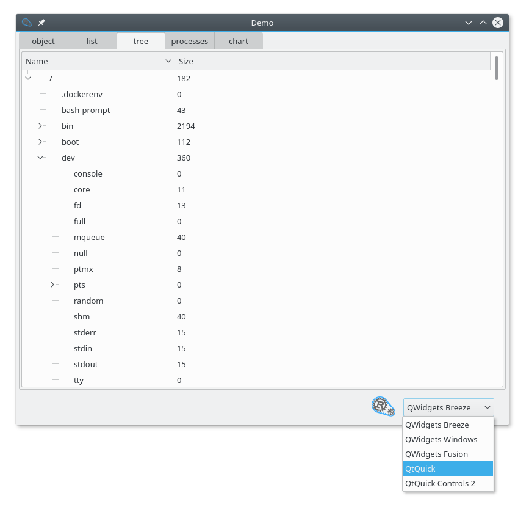
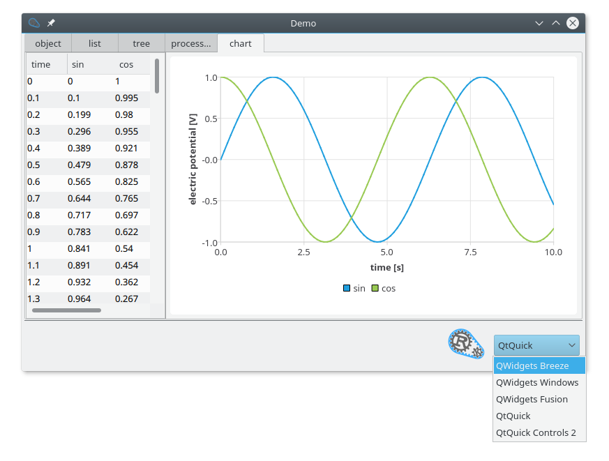

# Rust Qt Binding Generator


This code generator gets you started quickly to use Rust code from Qt and QML. In other words, it helps to create a Qt based GUI on top of Rust code.

Qt is a mature cross-platform graphical user interface library. Rust is a new programming language with strong compile time checks and a modern syntax.

## Getting started

There are two template projects that help you to get started quickly. One for [Qt Widgets](templates/qt_widgets) and one for [Qt Quick](templates/qt_quick). Just copy these folders as new project and start coding.


<table style="font-size: larger">
 <tr>
  <td style="background:#676767; color: white">Qt Widgets (main.cpp) / Qt Quick (main.qml)</td>
  <td>&#10229; UI code, written by hand</td>
 </tr>
 <tr>
  <td style="background:#3daefd">src/Binding.h</td>
  <td rowspan="3" style="valign: center">&#10229; generated from binding.json</td>
 </tr>
 <tr>
  <td style="background:#3daefd">src/Binding.cpp</td>
 </tr>
 <tr>
  <td style="background:#3daefd">rust/src/interface.rs</td>
 </tr>
 <tr>
  <td style="background:#676767; color: white">rust/src/implementation.rs</td>
  <td>&#10229; Rust code, written by hand</td>
 </tr>
</table>

To combine Qt and Rust, write an interface in a JSON file. From that, the generator creates Qt code and Rust code. The Qt code can be used directly. The Rust code has two files: interface and implementation. The interface can be used directly.

```json
{
    "cppFile": "src/Binding.cpp",
    "rust": {
        "dir": "rust",
        "interfaceModule": "interface",
        "implementationModule": "implementation"
    },
    "objects": {
        "Greeting": {
            "type": "Object",
            "properties": {
                "message": {
                    "type": "QString",
                    "write": true
                }
            }
        }
    }
}
```

This file describes an binding with one object, `Greeting`. `Greeting` has one property: `message`. It is a writable property.

The Rust Qt Binding Generator will create binding source code from this description:

```bash
rust_qt_binding_generator binding.json
```

This will create four files:

* *src/Binding.h*
* *src/Binding.cpp*
* *rust/src/interface.rs*
* rust/src/implementation.rs

Only `implementation.rs` should be changed. The other files are the binding. `implementation.rs` is initialy created with a simple implementation that is shown here with some comments.

```rust
use interface::*;

/// A Greeting
pub struct Greeting {
    /// Emit signals  the the Qt code.
    emit: GreetingEmitter,
    /// The message of the person.
    message: String,
}

/// Implementation of the binding
/// GreetingTrait is defined in interface.rs
impl GreetingTrait for Greeting {
    /// Create a new greeting with default data.
    fn new(emit: GreetingEmitter) -> Greeting {
        Greeting {
            emit: emit,
            message: "Hello World!",
        }
    }
    /// The emitter can emit signals to the Qt code.
    fn emit(&self) -> &GreetingEmitter {
        &self.emit
    }
    /// Get the message of the Greeting
    fn message(&self) -> &str {
        &self.message
    }
    /// Set the message of the Greeting
    fn set_message(&mut self, value: String) {
        self.message = value;
        self.emit.message_changed();
    }
}
```

The building block of Qt and QML projects are QObject and the Model View classes. `rust_qt_binding_generator` reads a json file to generate QObject or QAbstractItemModel classes that call into generated Rust files. For each type from the JSON file, a Rust trait is generated that should be implemented.

This way, Rust code can be called from Qt and QML projects.

### Qt Widgets with Rust

This C++ code uses the Rust code written above.

```cpp
#include "Binding.h"
#include <QDebug>
int main() {
    Greeting greeting;
    qDebug() << greeting.message();
    return 0;
}
```

### Qt Quick with Rust

This Qt Quick (QML) code uses the Rust code written above.

```qml
Rectangle {
    Greeting {
        id: rust
    }
    Text {
        text: rust.message
    }
}
```

## Demo application

The project comes with a demo application that show a Qt user interface based on Rust. It uses all of the features of Object, List and Tree. Reading the demo code is a good way to get started.

<figure>
  
  <figcaption><a href="demo/src/main.cpp">Qt Widgets UI</a> with <a href="demo/rust/src/implementation/file_system_tree.rs">Rust logic</a></figcaption>
</figure>

<figure>
  
  <figcaption><a href="demo/qml/DataAndChart.qml">Qt Quick Controls UI</a> with <a href="demo/rust/src/implementation/time_series.rs">Rust logic</a></figcaption>
</figure>

<figure>
  
  <figcaption><a href="demo/qml/FileTreeView2.qml">Qt Quick Controls 2 UI</a> with <a href="demo/rust/src/implementation/file_system_tree.rs">Rust logic</a></figcaption>
</figure>

## Docker development environment

To get started quickly, the project comes with a `Dockerfile`. You can start a docker session with the required dependencies with `./docker/docker-bash-session.sh`.

## More information on Qt

* [Qt](http://doc.qt.io/)
* [Qt Examples and tutorials](http://doc.qt.io/qt-5/qtexamplesandtutorials.html)
* [The QML Book](https://qmlbook.github.io/)
