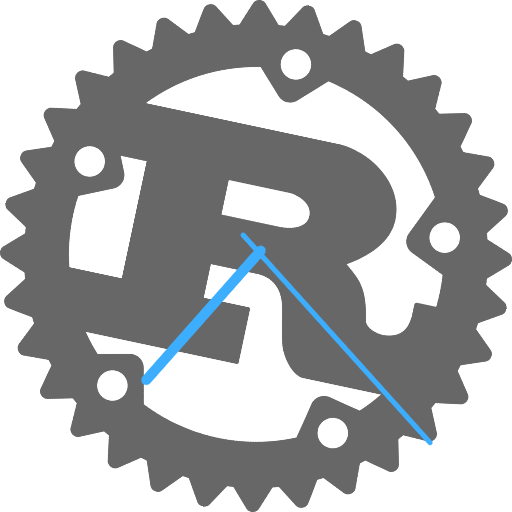
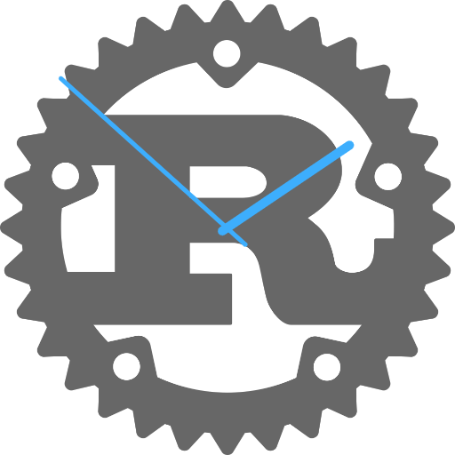

# Time for QML

If you are new to QML, I can recommend the [QML book](https://qmlbook.github.io/). It walks you through many wonderful examples. In addition, Qt Creator comes with [many more](https://doc.qt.io/qt-5/qtexamples.html).

It is a tradition in KDE to use clocks as examples. I will follow this tradition and create a widget that shows the time.

We'll start without any Rust at all. The first code is only QML. It uses the Rust logo as SVG image for the background, [`rust-logo-blk.svg`](https://www.rust-lang.org/logos/rust-logo-blk.svg). So download this file (or pick another SVG image and store it with that name).

The syntax of QML is declarative. The rotation of the Rust logo is given by the statement `angle: time.second * 6`. This is a binding. The value of `angle` updates automatically whenever `time.second` changes. The rotation of the logo changes every second because of this declarative binding.

Another example is `anchors.fill: parent` on the `Image` item. This means that the image takes up the same rectangular space as the parent item. If that item is resized, the image will scale along with it.

In this file, we added a temporary `QtObject` with properties `hour`, `minute` and `second`. The values in this object are updated every second by the `Timer` item. The JavaScript code between `{}` runs every second and updates the values in the `QtObject`. This object has `id: time` and the logo and hands are bound to this object.

The `QtObject` is a functional placeholder for the Rust code that we are going to write later.

```qml
// just_qml.qml

import QtQuick 2.5
import QtQuick.Window 2.2

Window {
    width: 512
    height: 512
    visible: true

    // A mock-up of the time object that we will
    // implement in Rust
    QtObject {
        id: time
        property int hour
        property int minute
        property int second
    }
    // This timer will also become Rust code
    Timer {
        interval: 1000; running: true; repeat: true
        onTriggered: {
            var date = new Date()
            time.hour = date.getHours()
            time.minute = date.getMinutes()
            time.second = date.getSeconds()
        }
    }

    // the clock face
    Image {
        anchors.fill: parent
        source: "rust-logo-blk.svg"
        sourceSize: Qt.size(width, height) // ensure rendered SVG canvas matches used size
        fillMode: Image.PreserveAspectFit
        transform: Rotation {
            origin.x: width / 2
            origin.y: height / 2
            angle: time.second * 6 // convert seconds to degrees
        }
    }
    // the minute hand
    Rectangle {
        id: minute
        x: (parent.width - width) / 2
        y: 0
        width: parent.width / 100
        height: parent.height / 1.8
        radius: width
        color: "#3daefd"
        transform: Rotation {
            origin.x: hour.width / 2
            origin.y: height / 2
            // convert minutes to degrees
            angle: time.minute * 6
        }
    }
    // the hour hand
    Rectangle {
        id: hour
        x: (parent.width - width) / 2
        y: parent.height / 6
        width: parent.width / 50
        height: parent.height / 2.8
        radius: width
        color: "#3daefd"
        transform: Rotation {
            origin.x: hour.width / 2
            origin.y: height / 3
            // convert hours to degrees
            angle: time.hour * 30 + time.minute / 2
        }
    }
}
```

You can run the plain QML file with the tool `qmlscene`.

```
$ qmlscene just_qml.qml
```


<figure>
  
  <figcaption>Time for Rust and QML</figcaption>
</figure>

`qmlscene` can run any plain QML files. If you have QML plugins installed, these can be used too. You can make plugins that are implemented in Rust, but we'll not go into that now.


## Set up a QML project with Rust

Before we can replace the `QtObject`, we have to set up a project. Rust Qt Binding Generator comes with a template project for QML in the folder [`templates/qt_quick`](https://commits.kde.org/rust-qt-binding-generator?path=templates/qt_quick).

You can get set up like so. You will need to have Qt, Rust and CMake installed.

First build `rust_qt_binding_generator`.

```
$ git clone git://anongit.kde.org/rust-qt-binding-generator
$ mkdir build
$ cd rust-qt-binding-generator/build
$ cmake ..
$ make rust_qt_binding_generator
$ export PATH=$PATH:$PWD/src
```

Now build and run the template project.

```
$ mkdir ../templates/qt_quick/build
$ cd ../templates/qt_quick/build
$ cmake ..
$ make
$ ./MyExe
```

You will be greeted with a 'Hello World' application.


## Starting from a template

So what just happened? The template project is based on CMake. CMake is the build system that most KDE projects use. A template in CMake is an example of how to add Rust code to KDE programs. It is possible to use another build system.

CMake performs four steps as instructed by the `CMakeLists.txt` file. It

1) generates Rust and C++ from `bindings.json` by calling `rust_qt_binding_generator`,
2) compiles the Rust code in `rust/` into a static library by calling `cargo`,
3) compiles the C++ code,
4) links the C++ objects, the QML files, and the Rust library into an executable.

If you prefer to use only `cargo`, you'll have to tell it to perform steps 1, 3 and 4 in a `build.js` file.


## Adding some Rust

Now let's turn this clock into the [Antikythera mechanism](https://en.wikipedia.org/wiki/Antikythera_mechanism) by adding some Rust.

We want the Rust code to have a Time object that indicates the hour, the minute and the second. We write this interface into `bindings.json`.

```json
{
    "cppFile": "src/Bindings.cpp",
    "rust": {
        "dir": "rust",
        "interfaceModule": "interface",
        "implementationModule": "implementation"
    },
    "objects": {
        "Time": {
            "type": "Object",
            "properties": {
                "hour": {
                    "type": "quint32"
                },
                "minute": {
                    "type": "quint32"
                },
                "second": {
                    "type": "quint32"
                }
            }
        }
    }
}
```

Now if we run `make` again, three files will be updated: `src/Bindings.h`, `src/Bindings.cpp`, and `rust/src/interface.rs`. And then we'll get a compile error from `cargo`.

That is because we have to adapt `rust/src/implementation.rs` to the new `interface.rs`. `interface.rs` specifies a trait that must be implemented in `implementation.rs`.

This is the generated trait:

```rust
// rust/src/interface.rs

pub trait TimeTrait {
    fn new(emit: TimeEmitter) -> Self;
    fn emit(&self) -> &TimeEmitter;
    fn hour(&self) -> u32;
    fn minute(&self) -> u32;
    fn second(&self) -> u32;
}
```

Note that the trait has getters, but no setters. With `"write": true`, you can add setters on properties.

For now, we implement a fixed time in our new `implementation.rs`.

```rust
// rust/src/implementation.rs

use interface::*;

pub struct Time {
    emit: TimeEmitter
}

impl TimeTrait for Time {
    fn new(emit: TimeEmitter) -> Self {
        Time {
            emit
        }
    }
    fn emit(&self) -> &TimeEmitter {
        &self.emit
    }
    fn hour(&self) -> u32 {
        1
    }
    fn minute(&self) -> u32 {
        52
    }
    fn second(&self) -> u32 {
        0
    }
}
```

Now whenever the QML application wants to know the time, it can ask the Rust code. Well, almost. We have to change three more files and one of them is a C++ file. It is a very simple change and it is needed to tell the QML code about the Rust QObject. In `src/main.cpp`, change this line:

```c++
    // src/main.cpp

    qmlRegisterType<Simple>("RustCode", 1, 0, "Simple");
```

to this

```c++
    // src/main.cpp

    qmlRegisterType<Time>("RustCode", 1, 0, "Time");
```

Next we add the Rust logo to the program, by copying the file `rust-logo-blk.svg` into the toplevel dir of the template and noting it as resource in `qml.qrc`. That file lists files that should be compiled into the executable.

```xml
<RCC>
    <qresource prefix="/">
        <file>main.qml</file>
        <file>rust-logo-blk.svg</file>
    </qresource>
</RCC>
```

Now create the file `main.qml`. The line `import RustCode 1.0` imports our Rust object into the application. Our mockup `QtObject` and the `Timer` have been replaced with `Time { id: time }`.

This `Time` still has the properties `hour`, `minute`, and `second`. Whenever these change, the user interface is updated.

```qml
// main.qml

import QtQuick 2.5
import QtQuick.Window 2.2
import RustCode 1.0

Window {
    width: 512
    height: 512
    visible: true

    // here is our Rust time
    Time {
        id: time
    }

    // the clock face
    Image {
        anchors.fill: parent
        source: "rust-logo-blk.svg"
        sourceSize: Qt.size(width, height) // ensure rendered SVG canvas matches used size
        fillMode: Image.PreserveAspectFit
        transform: Rotation {
            origin.x: width / 2
            origin.y: height / 2
            angle: time.second * 6 // convert seconds to degrees
        }
    }
    // the minute hand
    Rectangle {
        id: minute
        x: (parent.width - width) / 2
        y: 0
        width: parent.width / 100
        height: parent.height / 1.8
        radius: width
        color: "#3daefd"
        transform: Rotation {
            origin.x: hour.width / 2
            origin.y: height / 2
            // convert minutes to degrees
            angle: time.minute * 6
        }
    }
    // the hour hand
    Rectangle {
        id: hour
        x: (parent.width - width) / 2
        y: parent.height / 6
        width: parent.width / 50
        height: parent.height / 2.8
        radius: width
        color: "#3daefd"
        transform: Rotation {
            origin.x: hour.width / 2
            origin.y: height / 3
            // convert hours to degrees
            angle: time.hour * 30 + time.minute / 2
        }
    }
}
```


## Start the time

<figure>
  
  <figcaption>A happy clock</figcaption>
</figure>

Are you still here? That was quite a few instructions to follow for a simple example. The good news is that this setup does not get harder when you add more interfaces.

Anyway, now the part you've been waiting for. We will let Rust update the time and send it to the user interface. The crate `chrono` is used to get the time. Add it to `lib.rs` and `Cargo.toml`.

```toml
# rust/Cargo.toml
...

[dependencies]
chrono = "*"
...
```

```rust
// rust/src/lib.rs
...
extern crate chrono;
...
```

This code goes in `implementation.rs`. A thread wakes up every second and sends a signal to the user interface whenever a property changes.

```rust
// rust/src/implementation.rs

use interface::*;
use chrono::{Local, Timelike};
use std::thread;
use std::time::Duration;

pub struct Time {
    emit: TimeEmitter,
}

fn emit_time(emit: TimeEmitter) {
    thread::spawn(move || {
        loop {
            thread::sleep(Duration::from_secs(1));
            emit.second_changed();
            if Local::now().second() == 0 {
                emit.minute_changed();
                if Local::now().minute() == 0 {
                    emit.hour_changed();
                }
            }
        }
    });
}

impl TimeTrait for Time {
    fn new(emit: TimeEmitter) -> Self {
        emit_time(emit.clone());
        Time {
            emit
        }
    }
    fn emit(&self) -> &TimeEmitter {
        &self.emit
    }
    fn hour(&self) -> u32 {
        Local::now().hour()
    }
    fn minute(&self) -> u32 {
        Local::now().minute()
    }
    fn second(&self) -> u32 {
        Local::now().second()
    }
}
```


## Closing remarks

This was a pretty long tutorial with quite a few different parts. That was the point of the tutorial: to learn the parts that make up a binding between Qt and Rust.
